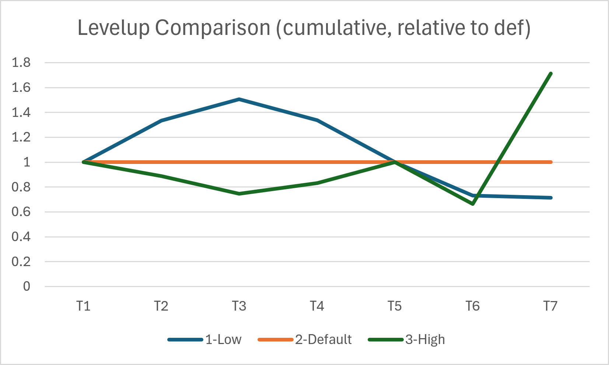

Initially, this just contains copies of posts from the idle1 discord.

6/2/26

(formula for constant income boost from EX)

Yes, 0.04 + (0.01 * pow/2).  This includes the 2 pow that you start with (1 normal pow and 1 idle)

This means that if you beat w1-w7 with no earned pow, you get 0.05 since you have the automatic 2 pow.  If you want the formula to start with the 0.05, then you need to subtract those 2, so 0.05 + (0.01 * (pow-2)/2)

(except, the 0.14 to 0.15 EX transition appears to happen at 22.5 POW rather than 22)

6/11/26

I just measured 20 color 1 completions:
- without manual: 87s
- with manual (not used): 87s
- with manual (held): 47s
- with manual (tapped): 53s

The in-game profit reporting looks incorrect to me.  I think it’s using 4s (rather than ~4.35) for the base.  It then shows 7x speedup rather than not quite 2x.  It also omits the small (1-8), fixed bonus due to EX that we see.

Time bomb on C1 takes about 25s.  So it’s 5-6x slower.  Income goes from 4 to 576, which 144x.  (Manual cuts the time in about half.)

6/12/26

I’ve been collecting data on completion rounds and times, and I’m convinced that with enough EX, short EX resets are far more efficient.  There are three main factors for this:
- The initial reset amount (0.05) is bigger than incremental gains (0.01 for 2 POW).
- Short resets don’t take all that many rounds (or time).  Beat W1 1-3 times to provide a boost to help with the W1-W7 run.
- Although the worlds in long resets get faster as POW goes up, they are limited by the first round in a world not getting any benefit from pow.  Specifically, W1R1 takes 1:40+ so these fast runs can’t get faster than that.

Putting it together, 0.05 EX is 100 W1s, and this can’t get much faster than 3 hours.  If a short reset takes less than this, short wins.  The question then becomes how much EX is needed for this to happen.

6/26/26

For a given earn_prestige value, your multiplier compared to before will be approximately

$$\text{earn}^{new - old}$$

7/2/26

I’ve been collecting a bunch of other data that I can start posting here.  Mostly this is for easy difficulty, but some things are unchanged and some have simple multipliers.  Corrections welcome!

First, prestige values (same for all difficulties?)  Note that the curves start (C5) at the opposite of the name but finish (upper machines) as stated.  Machine 7 isn’t useful since the level is finished.

|    | Low  | Med  | High |
| -: | ---: | ---: | ---: |
| C5 |    5 |    2 |    1 |
| C6 |   27 |    5 |    4 |
| C7 |  150 |   36 |   16 |
| C8 |  720 |  100 |   72 |
| C9 |   3k |  480 |  300 |
| M1 |   8k |   2k |   1k |
| M2 |  25k |   9k |   8k |
| M3 |  72k |  35k | 100k |
| M4 | 196k | 123k | 500k |
| M5 | 500k |   1M |   2M |
| M6 |   1M |   5M |  16M |
| M7 |   3M |  24M |  80M |

Each color has a base value for earn, multiplied by the number of that color that has been purchased.  A multiplier comes from the tier of purchases (like 10-25-50).  The different multiplier ranges only change when the tier changes, not the multiplier itself.  Here are the values, many rounded:

|    |   Low |   Def |    Hi |
| -: | ----: | ----: | ----: |
| T1 |     3 |     3 |     3 |
| T2 |     8 |     6 |  5.33 |
| T3 |    25 |    22 |  18.5 |
| T4 |   133 |   150 |   167 |
| T5 |  1260 |  1680 |  2025 |
| T6 | 21800 | 29800 | 19800 |
| T7 | 45900 | 47000 |  121k |

More interesting, perhaps, are the cumulative multipliers (using in-game e notation, not scientific):

|    |   Low |   Def |    Hi |
| -: | ----: | ----: | ----: |
| T1 |     3 |     3 |     3 |
| T2 |    24 |    18 |    16 |
| T3 |   600 |   396 |   296 |
| T4 |   79k |   59k |   49k |
| T5 |  100M |  100M |  100M |
| T6 |  2.2T |    3T |    2T |
| T7 | 100e1 | 140e1 | 240e1 |

Here are the cumulative values charted as a ratio compared to the default setting.  Like the prestige values, low and high start backwards from their names, all line up at the 5th upgrade, and then end up as their names suggest.

Tier 6 under the high setting might be a mistake.

The high fixed costs setting adds a 5x multiplier to C8 and 8x to C9.  The K factor will have an impact but is currently disabled in the game.

The value is also multiplied by the number purchased of that color and the bonus from earn/speed/EX.

7/3/26

We've been given that for earn:

$$\text{earn}_\text{net} = \text{earn}_\text{base} * (1 + 0.3 * \text{speed}^\text{EX} + 3.0 * \text{earn}^\text{EX})$$

EX here is 1.14 plus earned EX (equivalently, the EX shown in the creation room plus 0.14).

I'd guess that speed and cost follow a similar pattern but haven't computed them.  The constants could vary.

Earn base values (rounded, in-game e notation):

|    | $\text{earn}_\text{base}$ |
| -: | --------: |
| C1 |       4   |
| C2 |     413   |
| C3 |   17880   |
| C4 |   1.27M   |
| C5 |  97.44M   |
| C6 |   8.65B   |
| C7 |    882B   |
| C8 |    100T   |
| C9 | 12.76e1   |

7/8/26

The impact of the speed boost is more complicated.  Taking some times involves measurement error, and the upper colors are slow to wait for.  However, I believe the speed value follows the pattern for earn, and my guess is

$$\text{speed}_\text{net} = \text{speed}_\text{base} * (1 + 0.6 * \text{speed}^\text{EX})$$

where EX is again 1.14 plus earned EX (equivalently, the EX shown in the creation room plus 0.14).

The impact of speed on earn matches the curve given by the formula (so, 1/10 of the impact of earn)

$$\text{earn}_\text{net} = \text{earn}_\text{base} * (1 + 0.3 * \text{speed}^\text{EX} + 3.0 * \text{earn}^\text{EX})$$

However...

... there is some sort of separate penalty to earn applied.  You can see this by applying 1 speed to a color and noting that the earn goes down.  (prestige for 1 by using "high prestige curve" and resetting at C5, higher prestiges work too)

A portion of this penalty persists after hitting max speed.  However, the penalty stops going up.  If earn and speed are roughly the same (like if both are infinity), then the overall impact of speed actually reduces earn.  However, the increase in speed itself of course makes up for it.

The penalty seems to be independent of EX and color and only dependent on the speed_prestige value.  The penalty at max speed seems to be independent of EX but dependent on color.  (But, EX causes speed to max out earlier.)

The best formula that I've found to model the penalty is dividing earn by

$$1 + 0.462 * \text{speed}^{0.816 * EX + 0.039}$$

I don't think this is the actual formula, but it is close for the values that I've seen.  A few values: at 0 it is 1 (no penalty), at 1 it is ~0.68, 2 is ~0.51, 10 is ~0.18, 50 is ~0.05.

When speed is maxed, the penalty is around 40% less than where it maxed for that color.  C1 is ~0.4, C5 is ~0.11, C8 is ~0.07.

7/18/26

Some more game data:

Cost seems to have the most variation in the game.  The costs setting gives six different shapes to costs, and cost is how the  five difficulty levels impact the game.  (And K factor a bit, tbd)  Then each color is a bit different.

First, the simplest thing to explain is probably the cost prestige.  It is similar to the others.  Cost is divided by

$$1 + 3 * \text{cost}^\text{EX}$$

The minimum cost is 1.

Each purchase of a color increases the cost of the next purchase by a multiplier.  The multipliers vary by color.

|    | increase |
| -: | -------: |
| C1 |     15%  |
| C2 |   18.1%  |
| C3 |  20.18%  |
| C4 |   22.3%  |
| C5 |   24.4%  |
| C6 |   26.5%  |
| C7 |   28.6%  |
| C8 |   30.7%  |
| C9 |   32.8%  |

So basically, each color is 2.1% worse than the one before it _except_ that C1 to C2 is 3.1% and C3 is slightly off.  Maybe there's a simpler explanation, but this matches the data well.

For each world and color, we also need a starting point.  C1 is special.  It seems to have values assigned for each level rather than using multipliers across world settings.  The table below gives the cost for a hypothetical purchase number zero.  Therefore, the initial purchase in the game (number two) is found by applying the above multiplier twice.

|        | W1 | Std | Hi | Pl | Log | Exp |
| :----- | -: | --: | -: | -: | --: | --: |
| Easy   |  2 |  2  |  2 |  2 |   2 |   2 |
| Normal |  3 |  4  |  6 |  4 |   7 |   2 |
| Hard   |  3 |  4  |  7 |  4 |   8 |   2 |
| Crazy  |  4 |  6  |  9 |  6 |  10 |   3 |
| Evil   |  8 | 12  | 18 | 12 |  20 |   6 |